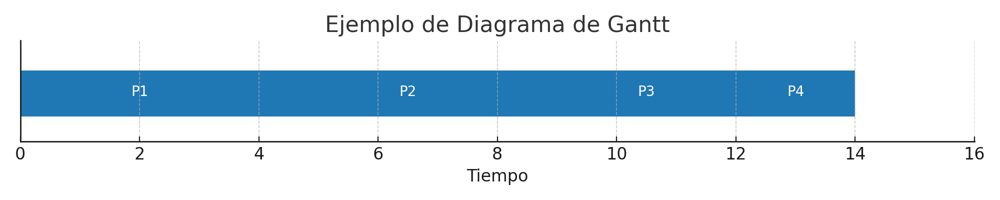
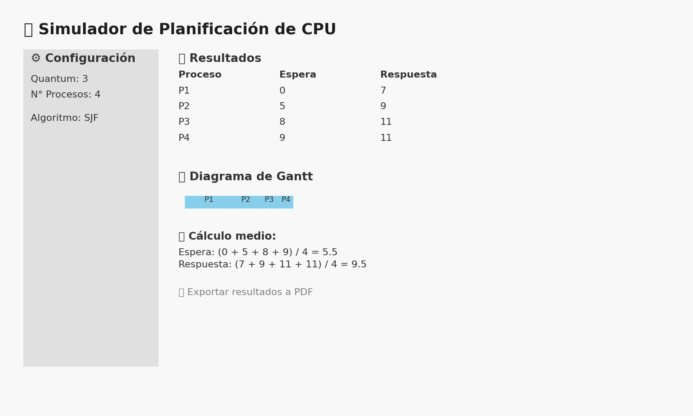

[](https://www.python.org/)
[](https://streamlit.io/)
[](https://github.com/ElWaje/Planificador_CPU/blob/main/LICENSE)
[](https://github.com/ElWaje/Planificador_CPU/stargazers)
[](https://github.com/ElWaje/Planificador_CPU/network/members)
[](https://github.com/ElWaje/Planificador_CPU/commits/main)
[](https://planificadorcpu-k23fd5tvdmyxx9wcaknxd3.streamlit.app/)


## ✨ Funcionalidades

- ✅ 6 Algoritmos disponibles:
  - FIFO (Primero en entrar, primero en salir)
  - SJF (El más corto primero)
  - SRTF (Tiempo restante más corto)
  - Prioridad (modo cooperativo y expropiativo)
  - Round Robin (con quantum configurable)

- 📊 Visualización tipo Diagrama de Gantt
- 📥 Cola de ejecución mostrada
- 🧮 Cálculos paso a paso de espera y respuesta
- 📄 Exportación de resultados a PDF
- 🌐 Interfaz gráfica con Streamlit

## 🚀 ¿Cómo empezar?

### Requisitos

- Python 3.8 o superior
- pip

### Instalación

```bash
pip install streamlit matplotlib pandas fpdf
```

### Ejecutar la aplicación

```bash
streamlit run app_web.py
```

Abre en el navegador la URL local (normalmente http://localhost:8501).

---

# 🧠 CPU Scheduling Simulator (Web GUI)

This is a web-based CPU Scheduling Simulator using **Streamlit**. You can input processes with arrival time, burst time and priority, then choose among six algorithms to simulate their behavior.

## ✨ Features

- ✅ 6 Scheduling Algorithms:
  - FIFO (First-In, First-Out)
  - SJF (Shortest Job First)
  - SRTF (Shortest Remaining Time First)
  - Priority Scheduling (Cooperative & Preemptive)
  - Round Robin (with configurable quantum)

- 📊 Gantt Chart Visualization
- 📥 Execution Queue Display
- 🧮 Step-by-step calculation of waiting and response time
- 📄 Export results to PDF
- 🌐 Interactive Streamlit Web GUI

## 🚀 Getting Started

### Prerequisites

- Python 3.8+
- pip

### Installation

```bash
pip install streamlit matplotlib pandas fpdf
```

### Run the App

```bash
streamlit run app_web.py
```

Then open http://localhost:8501 in your browser.

---

### 📷 Ejemplo de Diagrama de Gantt



---

Desarrollado con 💻 por [Enrique Solís]

---

### 🖥️ Vista previa de la interfaz

